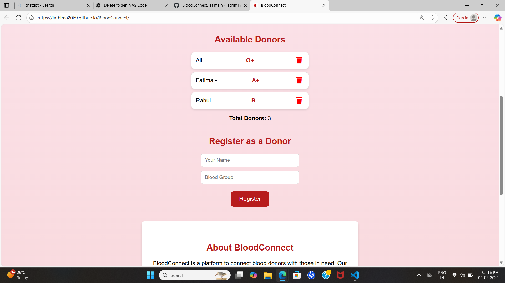

# 🩸 BloodConnect


BloodConnect is a simple web app to connect blood donors with people in need.  
It allows users to **search**, **filter**, **add**, and **delete** donors easily.

---

## 🚀 Features
- ✅ Add new donors with name and blood group  
- ✅ Delete donors with a 🗑️ button  
- ✅ Search donors by name  
- ✅ Filter donors by blood group  
- ✅ Donor count updates automatically  
- ✅ Works online with GitHub Pages  

---

## 📸 Screenshot
Here’s a preview of the app:

  

*(Replace `screenshot.png` with your actual uploaded image file name if different)*

---

## 🔗 Live Demo
[](https://fathima2069.github.io/BloodConnect/)


---

## 👩‍💻 Author
Created by **Fathima** 💖  

## 📊 Project Details  

| Key Feature      | Info                                    |
|------------------|-----------------------------------------|
| 💻 Tech Stack    | HTML, CSS, JavaScript                   |
| 🚀 Status        | Live ✅                                 |
| 🌐 Website       | [BloodConnect Live](https://fathima2069.github.io/BloodConnect/) |
| 📂 Repository    | [GitHub Repo](https://github.com/fathima2069/BloodConnect) |
| 👩‍💻 Author       | Fathima ❤️                             |
| 📅 Last Updated  | October 2025

## 🛠️ How to Use

1. **Visit the Website**  
   👉 [BloodConnect Live](https://fathima2069.github.io/BloodConnect/)

2. **Search Donors**  
   - Use the search box to find donors by name.  
   - Example: type `Ali` → only Ali appears.  

3. **Filter Donors**  
   - Use the dropdown menu to filter by blood group.  
   - Example: choose `A+` → only A+ donors are shown.  

4. **Register as a Donor**  
   - Enter your **name** and **blood group** in the form.  
   - Click **Register** → your name will be added to the donor list.  

5. **Delete a Donor**  
   - Click the 🗑️ button next to any donor.  
   - Confirm → the donor is removed from the list.  

6. **Check Donor Count**  
   - The **Total Donors** counter updates automatically.  
|
## 🔮 Future Improvements (Roadmap)

Here are some features planned for future versions of BloodConnect:

- 🔐 **User Login & Authentication** – Allow donors to create accounts and log in securely.  
- 🗄️ **Database Integration** – Store donor details in a real database instead of just the page.  
- 📍 **Location-based Search** – Show donors near the user’s city or area.  
- 📲 **Mobile Friendly App** – Make the design fully responsive and mobile optimized.  
- 📢 **Emergency Notifications** – Send alerts when a blood group is urgently needed.  
- 📊 **Analytics Dashboard** – Track donor registrations, most common blood groups, etc.

- ## 🤝 Contributing

Contributions are welcome! 🎉  
If you’d like to improve **BloodConnect**, here’s how you can help:

1. **Fork the repository**  
   - Click the "Fork" button on the top-right of this page.

2. **Clone your fork**  
   ```bash
   git clone https://github.com/your-username/BloodConnect.git

   ## 📜 License

This project is licensed under the **MIT License** – you are free to use, copy, and modify it with attribution.  
See the [LICENSE](LICENSE) file for details.


